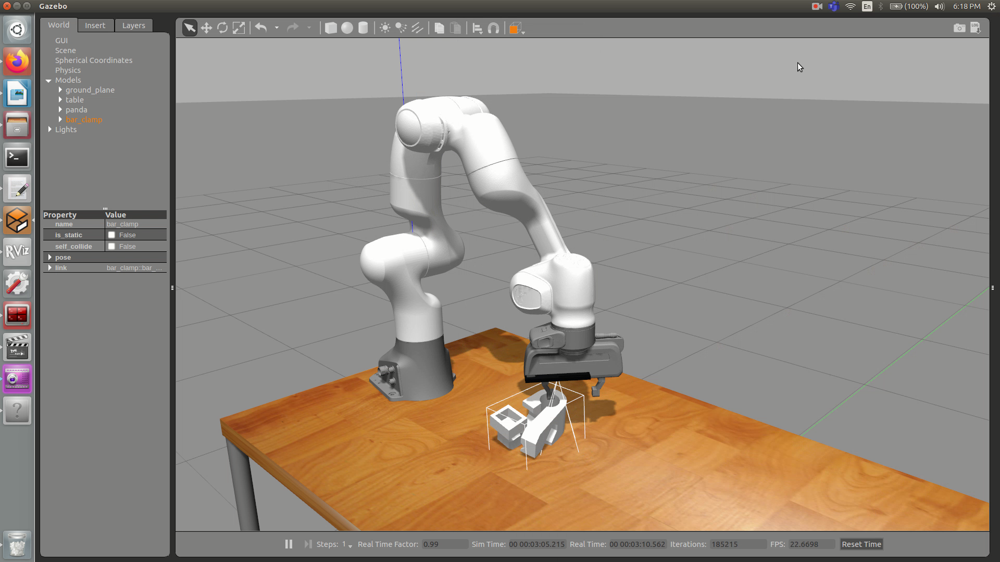

# Pick and Place with Franka Robot using GQCNN

Video of Franka Robot picking a bar clamp using GQCNN
[](https://www.youtube.com/watch?v=mrY0pSf1hX8)

## GQCNN Grasping Algorithm 
The gqcnn Python package is for training and analysis of Grasp Quality Convolutional Neural Networks (GQ-CNNs). It is part of the [Dexterity-Network (Dex-Net)](https://berkeleyautomation.github.io/dex-net/).

## Installation

The following instructions have been tested on **Ubuntu 16.04**.

1. Clone this repository into the `src` folder of your catkin workspace:

   ```
   cd <location_of_your_workspace>/src
   git clone https://github.com/SnehalD14/gqcnn
   git clone https://github.com/SnehalD14/autolab_core
   git clone https://github.com/SnehalD14/meshpy
   git clone https://github.com/SnehalD14/meshrender
   git clone https://github.com/SnehalD14/visualization
   git clone https://github.com/SnehalD14/perception
   git clone https://github.com/SnehalD14/perception   
   git clone https://github.com/SnehalD14/dex-net  
   ```

2. Build your catkin workspace:

   ```
   cd <location_of_your_workspace>
   catkin_make
   ```
3. For setting up the Franka simulation environment with Gazebo and Moveit, install [panda_simulation](https://github.com/SnehalD14/panda_simulation).


## Instructions 
1. Source the environment
   ```
   source devel/setup.bash
   ```

2. Launch the simulation environment from `panda_simualation`

   ```
   cd src
   roslaunch panda_simulation simulation.launch 
   ```

2. Launch GQCNN planner service

   The following command will initialize a ROS Service
   that waits for color image, depth image and camera intrinsics. Once a point data is received, the node will process the   
   data to obtain the best grasps.

   ```
   roslaunch gqcnn grasp_planning_service.launch
   ```
   Make sure to close the visualization window for the publisher to recieve the grasps. 

3. Run the GQCNN execution code

   We send message to the service client and obtain position and orientation. This code makes the robot move towards the
   object, grasps it and move away from the table with the grasped object. 
          
   Before running the execution code, make sure the robot is in the ``ready`` position
   ```
   cd gqcnn
   python ros_nodes/gqcnn_execution_node.py
   ```

## Reference 

Mahler, Jeffrey, Jacky Liang, Sherdil Niyaz, Michael Laskey, Richard Doan, Xinyu Liu, Juan Aparicio Ojea, and Ken Goldberg. [Dex-Net 2.0: Deep Learning to Plan Robust Grasps with Synthetic Point Clouds and Analytic Grasp Metrics.](https://arxiv.org/abs/1703.09312/) arXiv preprint arXiv:1703.09312 (2017). 

For usage please refer: [GQCNN docs](https://berkeleyautomation.github.io/gqcnn/)


